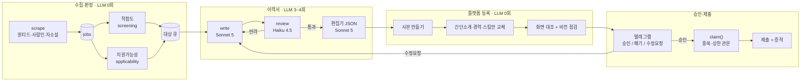

# autoapply — 무인 채용지원 파이프라인

채용공고를 모아 판정하고, 공고에 맞춰 이력서를 새로 쓰고, 플랫폼 편집기에 등록한 뒤,
지원 폼까지 채워 폰으로 승인을 요청한다. 사람이 하는 일은 **버튼 하나**다.

혼자 만들었고, 실제로 내 이름으로 지원이 나간다. 그래서 이 프로젝트의 절반은
기능이 아니라 **잘못 나가지 않게 막는 장치**다.

```
수집 4,108건 → 적합 2,785건 → 자동지원 가능 133건 → 대기열 124건 → 실제 제출 2건
Python 8,186줄 · 커밋 50개 · LLM 호출은 이력서를 쓸 때만
```

---

## 1. 문제

지원서 한 건에 40분이 든다. 공고를 읽고, 이력서에서 그 공고와 상관없는 경력을 빼고,
간단소개를 다시 쓰고, 스킬을 고르고, 폼을 채운다. **매번 같은 일인데 매번 다르다** —
같은 이력서를 그대로 내면 안 되기 때문이다.

자동화하려면 세 가지가 동시에 필요했다.

| | 어려운 지점 |
|---|---|
| 판단 | 이 공고가 나한테 맞나, 그리고 자동으로 지원이 *가능*한가 — 다른 질문이다 |
| 생성 | 공고마다 다른 이력서. 없는 경력을 지어내면 안 된다 |
| 조작 | 로그인된 브라우저에서 React 편집기를 채운다. 화면엔 들어갔는데 저장은 안 되는 일이 흔하다 |

---

## 2. 결과

**2026-08-16, 체인이 처음으로 끝까지 닫혔다.** 수집 → 판정 → 이력서 작성 → 플랫폼
등록 → 폰 승인 → 실제 제출까지, 사람은 텔레그램 버튼 하나만 눌렀다.

```
apply_ledger  #1025  데이원컴퍼니 [제로베이스] CSM 운영 매니저
              submitted 2026-08-16T15:11:47+09:00
              증적 스크린샷: "지원이 완료되었습니다!"
              이력서 완성도 100%
```

측정치 (실데이터):

| 지표 | 값 |
|---|---|
| 수집 공고 | 4,108건 (사람인 2,129 · 원티드 1,161 · 자소설 818) |
| 적합도 통과 | 2,785건 / 제외 1,323건 — **LLM 0회** |
| 자동지원 가능 | 133건 → 대기열 124건 (폐기·기지원·플랫폼 간 중복 제외) |
| 이력서 조립 | 40초, 72시간 캐시 |
| 폰 승인 응답 | 2.9초 (초기 2시간) |
| 이력서 완성도 | 71% 정체 → **100%** |
| 운영 | launchd 2시간 주기 + 롱폴링 상주 |

트랙 분포를 보면 왜 "개발자용 이력서 하나"로는 안 되는지가 드러난다 —
적합 판정된 2,785건 중 개발 트랙은 **467건뿐**이고, 경영지원/마케팅/영업이 1,972건이다.

---

## 3. 아키텍처



---

## 4. 설계에서 가장 중요했던 판단들

### 4-1. 판정 축을 둘로 갈랐다

"이 공고가 나한테 맞나"와 "이걸 자동으로 지원할 수 있나"는 **직교한다.**

실측에서 132점 최고점 공고가 `NO_RECIPE` 하나 때문에 막혔고, 반대로 점수는 낮은데
폼이 단순한 공고도 있었다. 하나의 점수로 뭉개면 시스템은 **"왜 지원 안 했는지"를
설명할 수 없다.** 사람이 안 보는 시스템에서 설명 불가는 곧 디버깅 불가다.

지금은 막힌 이유가 코드로 남는다:

```json
[{"code": "SCORE_BELOW_BAR", "detail": "73점 < 기준 75점"},
 {"code": "NO_DETAIL",       "detail": "본문 0자 < 기준 200자"}]
```

`cli.py blocked` 한 줄로 "무엇을 고치면 몇 건이 열리는지"가 나온다. 실제로 그걸 보고
`detail_limit`을 올렸다.

### 4-2. 중복지원 방어를 코드가 아니라 스키마에 뒀다

`apply_ledger.canonical_key`에 UNIQUE를 걸고, **지원을 시도하기 전에** 선점 행을
넣는다. 지원 도중 프로세스가 죽어도 다음 실행이 같은 자리를 다시 건드리지 않는다.

바로 값을 했다 — 원티드가 같은 자리를 `id=280`, `id=281`로 두 번 올려놨다.

```
claim(280) → ledger 1     선점 성공
claim(281) → None         같은 자리, 차단
```

코드로 막지 않은 이유: 사람이 안 보는 시스템에서 "죽었다 살아나서 또 지원"은
**반드시** 일어나고, 그때 회사에 사과할 사람이 없다.

### 4-3. UNIQUE가 못 막는 것을 따로 막았다

UNIQUE는 "같은 자리에 두 번"만 막는다. "서로 다른 200개 자리에 새벽 3시에 연속 지원"은
못 막는다. 루프 버그 하나면 그 일이 벌어진다.

모든 지원이 `claim()` 하나를 지나므로 거기서 센다.

```yaml
limits:
  max_per_day: 10   # 하루 누적
  max_per_run: 3    # 실행 1회당 — 루프 버그가 하루치를 한 번에 태우는 걸 막는다
```

상한에 걸리면 예외가 아니라 `None`을 돌려준다. 호출부는 이미 "None이면 넘어간다"를
처리하고 있다. **상한을 새 실패 경로로 만들면 처리를 빼먹은 곳에서 프로세스가 죽고,
그건 우아한 실패가 아니다.**

### 4-4. LLM을 어디에 *넣지 않을지*를 먼저 정했다

| 코드로 끝내는 것 | 왜 |
|---|---|
| 수집·하드컷·점수 | 순수 문자열 연산. 4,108건에 LLM 0회 |
| 지원가능성 판정 | 정규식·파일존재·날짜 비교 |
| 중복 판정 | `canonical_key` 정규화 후 완전일치 |
| 제출 확인 | 완료 화면 존재 여부 |

여기에 LLM을 넣으면 느려지고 비싸지고, 무엇보다 **같은 입력에 다른 답이 나와서
"왜 지원했는지"를 재현할 수 없게 된다.**

LLM은 이력서를 쓰는 곳에만 있다. 그리고 거기서도 한 모델에 통째로 맡기지 않았다.

| 단계 | 모델 | 하는 일 |
|---|---|---|
| `write()` | Sonnet 5 | 공고 + 작성 가이드 + **사실 저장소**를 읽고 쓴다. 저장소에 없는 수치·기술은 못 쓴다 |
| `review()` | Haiku 4.5 | 치명적 문제만 — 날조, 확정값 불일치, 필수요건 누락. **문체는 안 건드린다** |
| `write(feedback)` | Sonnet 5 | 반려 사유만 고쳐 재작성, 최대 2라운드 |
| `to_editor_json()` | Sonnet 5 | 편집기 스키마로 옮기고, `[필수]` 근거 없음이 1건이라도 있으면 **지원을 멈춘다** |

**쓰는 눈과 보는 눈을 갈라야 자기가 지어낸 걸 잡는다.** 검수를 문체까지 보게 하면
취향으로 반려해서 루프가 안 끝난다 — 그래서 검수 프롬프트에서 문체를 명시적으로 뺐다.

### 4-5. 71% 정체를 기능이 아니라 문제 재정의로 풀었다

이력서 완성도가 몇 주 동안 71%에서 멈췄다. 원인은 두 가지 — 학력이 저장되지 않았고,
링크 입력이 타임아웃 났다. 셀렉터를 계속 고쳤지만 이 층은 원래 잘 깨진다.

그러다 깨달은 것: **학력·링크·언어는 공고가 바뀌어도 안 바뀐다.** 매번 채울 이유가 없다.

원티드 이력서 목록의 `···` 메뉴에 **사본 만들기**가 있었다. 완성된 템플릿을 복제하면
안 바뀌는 것은 그대로 따라오고, 파이프라인은 **간단소개·경력·스킬만** 건드리면 된다.

```python
COPY_STEPS = ("text", "experience", "dates", "selects", "skills")
# 학력·링크·언어는 의도적으로 없다 — 사본이 들고 온다
```

결과: 완성도 100%, 그리고 가장 잘 깨지던 코드 경로가 통째로 사라졌다.
덤으로 트랙별 템플릿(개발자용/데브옵스/AX/영업)을 두어 시작점 자체를 갈랐다.

### 4-6. 개발 이력을 비개발 공고용으로 다시 쓰게 했다

영업 공고에 지원하는데 내용도 스킬도 개발 얘기였다. 작성 가이드 뒤쪽에 규칙을 적어뒀지만
**긴 가이드에 묻힌 규칙은 무시된다.**

그래서 트랙이 비개발일 때만 프롬프트 본문에 재해석 규칙을 직접 주입한다(`_track_block`).
스킬도 마찬가지 — 원티드 스킬 칸은 고정 사전이라 서술형 문구가 아예 등록되지 않는다.
도구 고유명사만 쓰게 제한하니 **5/5 등록**됐다.

### 4-7. 폰이 유일한 인터페이스다

셀렉터나 로그를 보내는 건 의미가 없다. 사람은 `button.css-1x2y3z`가 맞는 버튼인지
알 수 없지만 **다 채워진 폼 스크린샷은 안다.**

승인은 세 갈래다. 예/아니오로는 부족했다 — 대부분의 "아니오"는 거절이 아니라 수정 요청이다.

```
[승인]  [폐기 — 지원대상에서 제외]  [수정요청]
                                        ↓
                          자유 텍스트 지시 → 재작성 → 다시 승인 요청
```

### 4-8. 브라우저 창을 한 번만 띄운다

작업 중에 브라우저 창이 계속 튀어나와 화면을 가로챘다. headless는 원티드가 403으로
막고, 창 숨기기는 macOS가 위치를 되돌린다.

해법은 창을 숨기는 게 아니라 **띄우는 횟수를 바꾸는 것**이었다. CDP 9222로 상주
브라우저 하나를 띄워두고, 이후 모든 프로세스가 거기에 붙는다. 사람이 한 번 숨기면
새 창이 안 나오니 계속 숨어 있다.

```python
def _attach(self):
    return connect_over_cdp(CDP_URL, timeout=3000)   # 있으면 붙고, 없으면 그때만 띄운다
```

숨긴 상태로 이력서 14건 조회에 8.8초. 창은 뜨지 않았다.

---

## 5. 브라우저 자동화에서 반복해 밟은 함정

전부 **"시킨 대로 됐다고 믿었는데 아니었던"** 부류다. 화면에는 정상으로 보인다.

| 증상 | 원인 |
|---|---|
| 값이 화면엔 있는데 새로고침하면 사라짐 | React 제어 입력에 blur/change가 안 나감 → `click → fill → Tab` |
| 회사명·학교명이 잘려서 저장됨 | 자동완성 드롭다운 재렌더 중 타이핑 유실. **확정 후 대조·교정이 본체** |
| 날짜를 골랐는데 되돌아감 | 저장 요청이 아예 안 나감. 같은 항목의 다른 칸을 건드려야 PATCH가 나간다 |
| 날짜가 엉뚱한 칸에 들어감 | `has-text("YYYY.MM")`은 빈 칸만 잡아 채울 때마다 인덱스가 밀림 |
| 클릭이 15초 타임아웃 | 팝업 뒤 투명 백드롭이 가로챔. 단 submit은 force 금지 |
| 다음 섹션이 안 열림 | 앞 섹션 팝업이 살아있음. Escape로는 안 닫히고 **다른 제목을 클릭**해야 닫힘 |
| 완성도 100%인데 지원에 못 씀 | `작성 완료`를 눌러야 '작성 중'을 벗어난다 |

그래서 모든 입력 뒤에 **넣은 값과 저장된 값을 대조**한다. 그리고 실패를 세 가지로
구분한다 — `filled`(들어감) / `lost`(들어갔다 사라짐) / `missing`(아예 안 들어감).
원인이 다르므로 같은 실패로 뭉치면 고칠 수 없다.

DOM 대조가 못 보는 층은 **스크린샷 판독**이 본다(`vision.py`). 안 건드린 섹션이 비었는지,
오류 배너가 떴는지 — 그리고 이건 플랫폼을 몰라도 되므로 사람인·자소설에 그대로 쓴다.

> 검증기가 오탐을 내면 무시당한다. 플랫폼이 깔아둔 빈 템플릿 행을 계속 문제라고
> 보고하길래, **무엇을 지적하지 않을지**(`ignore`)를 명시하는 파라미터를 뒀다.

---

## 6. 사고 회고 — 내 이력서를 지웠다

이력서 정리 기능을 돌렸는데 dry-run이 아니었고, **파이프라인이 만들지 않은 이력서
하나가 삭제됐다.** 지원 기록에도 로컬 사본에도 없어 복구하지 못했다.

원인은 플래그가 아니라 **기준의 순서**였다. 선택 조건이 "오래되었거나 개수를 넘은 것"
뿐이었고, 그 조건은 *누가 만들었는지를 한 번도 묻지 않는다.*

고친 방식:

- `made_resumes` 테이블을 **소유의 근거**로 뒀다. 만들자마자 기록한다 — 채우다 실패한
  것도 우리가 치울 물건이기 때문이다
- 나이·개수는 이제 **무엇을 지울지가 아니라, 우리 것 중 무엇부터 지울지**를 정한다
- 기록에 없으면 건드리지 않고 `우리 것 아님(건너뜀)`으로 보고한다

**안 지워지는 쪽이 잘못 지우는 쪽보다 훨씬 가볍다.** 되돌릴 수 없는 동작에서는
기본값이 안전한 쪽이어야 한다는 걸 대가를 치르고 배웠다.

---

## 7. 기술 스택과 구성

**Python 3.12 · SQLite · Playwright(CDP) · httpx · launchd · Telegram Bot API ·
Claude CLI (Sonnet 5 / Haiku 4.5)**

의존성은 4개뿐이다(`httpx`, `selectolax`, `pyyaml`, `playwright`). PDF도 Chromium의
print-to-PDF로 굽는다 — 이미 있는 것을 쓰면 새 의존성이 안 는다.

```
config.yaml              필터·기준·템플릿. 코드 수정 없이 여기만 고친다
recipes/wanted.json      지원 폼 + 편집기 셀렉터 (아래 참조)
cli.py                   진입점. 출력은 항상 JSON
schedule/                launchd — 2시간 주기 + 롱폴링 상주
src/autoapply/
  normalize.py           canonical_key — 중복지원 방어선
  db.py                  스키마 · 뷰 · 마이그레이션
  agent.py               claim / mark_submitted / quota — 모든 지원이 지나는 관문
  screening/             축1 적합도 · 축2 지원가능성
  assemble.py            이력서 조립: 작성 → 검수 → 재작성
  vision.py              스크린샷 판독 (플랫폼 독립)
  health.py              L1 이상 감지 · LLM 0회
  orchestrator.py        자가개선. 브랜치에서만 움직인다
  runner/
    session.py           브라우저 수명 — CDP 상주 창 재사용
    resume_editor.py     편집기 자동화 (1,649줄, 가장 큰 파일)
    apply.py             레시피 실행. dry-run이 기본값
  notify/                텔레그램 — 알림 · 승인 버튼 · 명령 수신
```

**셀렉터를 파이썬이 아니라 레시피(JSON)에 둔 이유**: 자가수복 에이전트는 레시피만
고칠 수 있게 막아뒀다. dry-run 스크린샷이라는 **검증 오라클**이 있기 때문이다.
파이썬 코드는 오라클이 없어서 손대지 못하게 한다.

**자가개선 루프**는 `orchestrator.py`가 담당한다. 실패 증적을 모아 코딩 에이전트에게
넘기는데, 여기서도 함정을 하나 밟았다 — 스크린샷 *경로*만 주면 읽을지 말지가
에이전트에게 달렸고, 실제로 안 읽고 셀렉터를 추측으로 고친 적이 있다. 그래서 지금은
**넘기기 전에 먼저 읽어 글로 바꿔** 할 일 본문에 박는다.

---

## 8. 한계

포트폴리오에 "완성"이라고 쓸 생각은 없다. 지금 시점의 정직한 상태는 이렇다.

| 항목 | 상태 |
|---|---|
| 원티드 전 구간 | 실제 제출까지 검증됨 |
| 사람인·자소설 | 어댑터는 검증(2,129 / 818건). 지원 레시피 미작성 |
| 경력 회사 2건 이상 | 사실 저장소에 1건뿐이라 미검증 |
| 스킬 정리(prune) | 삭제 후 추가가 안 됨. 기본 꺼둠 |
| 자가개선 | 신호는 뜬다. **진짜 고장을 고치는지는 아직 안 돌려봤다** |

**신호가 뜨는 것과 고쳐지는 것은 다르다.** 한 건 성공했다고 무인 운영이 검증된 것도
아니다 — 2시간 주기로 도는 동안 세션 만료·수집 급감·이상 감지가 실제로 작동하는지는
시간이 지나야 드러난다. 지금 가장 필요한 건 새 기능이 아니라 **며칠간 그냥 돌려보는 것**이다.

---

작업 기준 문서는 [TODO.md](TODO.md), 함정과 그 이유는 [NEXT.md](NEXT.md)에 있다.
