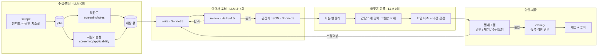

# autoapply

채용공고 수집부터 이력서 조립, 플랫폼 등록, 지원 폼 작성까지 자동으로 처리하는
무인 채용지원 파이프라인입니다. 사람은 마지막에 폰에서 버튼 하나만 누릅니다.

```bash
python cli.py browser-open                # 상주 브라우저 창을 띄웁니다 (한 번만)
python cli.py autoapply <job_id>          # 조립 → 등록 → 폼 작성 (dry-run)
python cli.py autoapply <job_id> --live   # 실제 제출. 되돌릴 수 없습니다
python cli.py cycle-apply                 # 대기열 상위 1건을 준비하고 폰으로 스크린샷을 보냅니다
python cli.py revise <job_id> "<지시>"    # 수정 요청을 반영해 다시 만들고 재검토를 요청합니다
python cli.py builds                      # 이력서 조립·등록 기록 (왜 미완인지)
python cli.py status                      # 한 줄 요약
python cli.py blocked                     # 무엇이 왜 막혔는지
python cli.py resumes                     # 플랫폼 이력서 목록 (읽기 전용)
```

실측 결과와 설계 판단의 서사는 [PORTFOLIO.md](PORTFOLIO.md)에, 안전 불변조건과
작업 원칙은 [CLAUDE.md](CLAUDE.md)에 있습니다. 이 문서는 **레이어가 왜 이렇게
나뉘었는지, 그리고 각 경계에서 무엇과 싸웠는지**를 다룹니다.

```
수집 4,108건 → 적합 2,785건 → 자동지원 가능 133건 → 대기열 124건 → 실제 제출 2건
Python 약 13,000줄 · LLM 호출은 이력서를 쓰는 구간에만
```

---

## 1. 아키텍처 — 레이어

```
CLI / Telegram / API
        │  (진입점만 다를 뿐 같은 함수를 부릅니다)
        ▼
    Workflow          "이 업무를 어떤 단계로 수행하는가" — prepare / submit / revise / night_cycle
        │
        ▼
  Agent · Services     claim/mark_submitted(원장) · assemble(이력서) · screening(판정) · notify
        │
        ▼
      Domain           normalize(canonical_key) · db(스키마·뷰)
        ▲                        ▲
        │                        │
   Orchestrator          Adapters · Infrastructure
   (자기개선 전용)         wanted/saramin/jasoseol · runner(브라우저) · llm(CLI 호출)
```

레이어 사이 경계는 코드 편의가 아니라 **책임의 경계**입니다. 몰라도 되는 것을
서로 모르게 하는 것이 핵심입니다.

### CLI / Telegram — 진입점

`cli.py`와 `notify/listener.py`는 얇습니다. 인자 파싱, 라우팅, JSON 출력,
exit code가 전부이고 DB 쿼리·브라우저 실행·알림 조립·재시도 로직을 직접 하지
않습니다. 텔레그램 버튼이 누른 명령과 CLI 서브커맨드가 결국 같은 workflow
함수를 부르기 때문에, 폰에서 온 요청과 사람이 터미널에서 친 명령을 다르게
처리할 필요가 없습니다.

### Workflow — 업무 단계

`src/autoapply/workflows/`에 있습니다. **워크플로는 진입점을 모릅니다** —
`print`/`sys.exit`/`argparse.Namespace`를 쓰지 않으므로 argparse가 부르든
텔레그램 리스너가 부르든 동작이 같습니다.

| 파일 | 책임 |
|---|---|
| `context.py` | 지원 실행 전 이 공고에 대해 알아야 하는 사실. `prepare_application`과 `submit_application`이 둘 다 참조하므로 여기 둡니다 — 한쪽에 두면 두 워크플로가 서로를 알게 됩니다 |
| `prepare_application.py` | 조립 → 이력서 등록 → 지원 폼(dry-run 기본). 중단 가능 지점이 네 곳 있고, 편집기가 자동저장이라 `fill()` 안에서는 끊지 않습니다 |
| `submit_application.py` | 되돌릴 수 없는 외부 side effect가 실제로 일어나는 자리. `preflight → claim → run → mark_submitted`가 여기 있습니다 |
| `revise_application.py` | 수정 요청 반영 재작성. 이전 이력서를 이어받지 않습니다(`reuse=False`) — 이어받으면 "다르게 써 달라"는 요청이 무시된 채 옛 결과가 다시 승인 카드로 올라갑니다 |
| `night_cycle.py` | 새벽 사이클. 목표 건수 또는 대기열 소진까지 반복하고, 같은 오류가 세 번이면 서킷브레이커가 끊습니다 |

### Agent · Services — 도메인 정책

`agent.py`(claim/mark_submitted/quota)가 **모든 지원이 지나는 관문**입니다.
`assemble.py`(이력서 작성·검수·재작성), `screening/`(적합도·지원가능성 판정),
`notify/`(텔레그램)가 이 층에 있습니다. 워크플로가 "어떤 순서로"를 정하면
이 층이 "각 단계에서 무엇을"을 정합니다.

### Domain — 상태와 규칙

`normalize.py`의 `canonical_key`(중복지원 방어선)와 `db.py`의 스키마·뷰가
가장 아래에 있습니다. 플랫폼이 무엇이든, LLM이 무엇을 썼든 이 층은 신경 쓰지
않습니다.

### Adapters · Infrastructure — 바깥 세계

`adapters/`(wanted/saramin/jasoseol)는 플랫폼 차이를 여기서 흡수합니다.
**플랫폼의 HTML 문구가 domain으로 올라오지 않게 막는 층**입니다. `runner/`는
브라우저 자동화, `llm.py`는 claude CLI 호출을 감쌉니다. 셀렉터는 파이썬이
아니라 `recipes/*.json`에 선언적으로 둡니다 — business policy 없이 "이
selector를 클릭한다"만 표현합니다.

### Orchestrator — 별도 축

`orchestrator.py`는 런타임 지원 워크플로와 **분리된 자기개선 전용** 축입니다.
오류 감지 → 원인 분류 → 수정 계획 → 위험도 확인 → 승인된 변경 → 검증 →
commit/revert 순으로 돌고, 브랜치에서만 움직이며 main에 임의로 반영하지
않습니다.

---

## 2. 파이프라인 — 한 사이클



판정 축은 두 개로 나뉩니다. "이 공고가 나한테 맞나"(적합도)와 "이걸 자동으로
지원할 수 있나"(지원가능성)는 독립적인 질문입니다. 132점짜리 최고점 공고가
`NO_RECIPE` 하나로 막혔던 실측이 있었고, 하나의 점수로 뭉개면 "왜 지원하지
않았는지"를 시스템 스스로 설명할 수 없게 됩니다.

LLM은 이력서를 쓰는 구간에만 있고, 거기서도 역할을 나눕니다.

| 단계 | 모델 | 왜 나눴는가 |
|---|---|---|
| `write()` | Sonnet 5 | 사실 저장소(작성 가이드)를 벗어난 수치·경력은 쓸 수 없습니다 |
| `review()` | Haiku 4.5 | 치명적 문제(날조·불일치·필수요건 누락)만 봅니다. 문체는 의도적으로 배제 — 검수 모델이 문체까지 보면 취향 문제로 반려해 루프가 안 끝났습니다 |
| `write(feedback)` | Sonnet 5 | 반려 사유만 고쳐 다시 씁니다. 최대 2라운드 |
| `to_editor_json()` | Sonnet 5 | 근거 없는 `[필수]` 항목이 하나라도 있으면 지원 자체를 멈춥니다 |

쓰는 눈과 보는 눈을 가른 이유는 같은 모델이 스스로 지어낸 내용을 스스로
잡아내기 어렵기 때문입니다.

---

## 3. 기술적 난제

### 3-1. 판정 근거가 실제 이력서와 어긋나는 사각지대

적합도 점수는 공고에 그 키워드가 있는지만 세고, 사용자가 실제로 그 경력을
가졌는지와 대조하지 않습니다. 132점짜리 Java/Spring 백엔드 공고를 실제로
조립해보니 Java 실무·Oracle·ERP 전부 근거가 없었습니다. 어셈블러가 조립
과정에서 그걸 이미 판별하고 있었으므로, 그 결과를 `resume_builds`에 남기고
지원가능성 판정이 `REQUIREMENT_GAP`으로 읽게 했습니다. 한 번 조립해본
공고에만 붙는 신호라 첫 시도가 알아내고, 다음 판정부터 그 공고가 목록에서
빠집니다.

### 3-2. 세션 생사를 확인 불가와 구분하기

원티드 지원은 OAuth 로그인이 필요하고 **자동 로그인 경로가 없습니다.**
그래서 세션이 죽었는지를 정확히 아는 것이 중요한데, 판정을 세 갈래로
나눴습니다.

```
로그인 페이지로 확실히 이동됨        → 죽음
로그인 상태에서만 되는 URL 확인됨    → 살아있음
둘 다 아님                          → 확인 불가
```

**확인 불가를 죽음으로 단정하지 않습니다.** DOM 셀렉터 방식은 실제로 새벽
콜드스타트에서 멀쩡한 세션을 죽었다고 오판했습니다 — 렌더링 타이밍에
좌우되기 때문입니다. URL 리다이렉트를 먼저 보게 하니 느린 환경에서도
흔들리지 않았습니다.

DOM 대조가 못 보는 층(건드리지 않은 섹션이 비었는지, 오류 배너가 떴는지)은
스크린샷 판독(`vision.py`)이 봅니다 — 플랫폼을 몰라도 되는 검증 층이라
사람인·자소설에도 그대로 재사용됩니다.

---

## 4. 최적화

### 4-1. 이력서 완성도 71% 정체 — 기능이 아니라 문제 재정의로 풀기

완성도가 몇 주 동안 71%에서 멈춰 있었습니다. 학력이 저장되지 않고 링크 입력이
타임아웃 났습니다. 셀렉터를 계속 고쳤지만 이 층은 원래 잘 깨집니다.

알아챈 것은 **학력·링크·언어는 공고가 바뀌어도 안 바뀐다**는 사실이었습니다.
매번 채울 이유가 없습니다. 원티드 이력서 목록의 `···` 메뉴에 있는 "사본
만들기"로 완성된 템플릿을 복제하면, 안 바뀌는 항목은 그대로 따라오고
파이프라인은 바뀌는 것만 건드립니다.

```python
COPY_STEPS = ("text", "experience", "dates", "selects", "skills")
# 학력·링크·언어는 의도적으로 없다 — 사본이 들고 온다
```

결과는 완성도 100%, 그리고 **가장 잘 깨지던 코드 경로가 통째로 사라진 것**
입니다. 트랙별(개발자용/데브옵스/AX/영업) 시작점을 나눌 수 있게 된 것은
덤입니다.

### 4-2. 상주 브라우저 — 창을 한 번만 띄운다

CDP 9222로 상주 브라우저 하나를 띄워두고 이후 모든 프로세스가 거기에
붙습니다.

```python
def _attach(self):
    return connect_over_cdp(CDP_URL, timeout=3000)   # 있으면 붙고, 없을 때만 띄운다
```

붙은 세션은 `close()`에서 창을 닫지 않습니다(`pw.stop()`만 합니다). 닫으면
다음 실행이 다시 띄우게 되어 원점으로 돌아갑니다. 사람이 창을 한 번 숨기면
이후 새 창이 안 뜨므로 계속 숨어 있습니다 — 숨긴 상태로 이력서 14건 조회에
8.8초가 걸렸습니다.

### 4-3. 이력서 조립 캐시 — 72시간

같은 공고에 대한 이력서 조립 결과를 72시간 캐시합니다. 수정 요청이 있으면
캐시를 우회합니다 — 캐시된 결과를 다시 주면 수정 루프가 끝나지 않기
때문입니다.

### 4-4. 사람이 만든 리소스를 추측으로 지우지 않는다

이력서 정리가 필요해질 때마다 "무엇을 지울지"를 나이·개수만으로 정하면, 사람이
만든 이력서까지 지울 수 있습니다(실제로 한 번 그랬습니다 — §7). 지금은
`made_resumes`가 소유의 근거이고, 만들자마자 기록합니다. 나이·개수는 이제
**우리 것 중에서** 무엇부터 지울지만 정하고, 기록에 없으면 건드리지 않고
"우리 것 아님(건너뜀)"으로 보고합니다.

---

## 5. 토큰 최적화

### 5-1. CLI 하네스를 걷어낸다 — 입력 토큰 84% 감소

이력서 작성에 쓰는 `claude` CLI는 원래 **코딩 에이전트 하네스**입니다. 옵션
없이 부르면 매 호출마다 시스템 프롬프트(약 11k 토큰)·툴 정의·MCP 서버·플러그인·
설정이 전부 얹힙니다. 우리가 필요한 건 텍스트 생성 한 번뿐이므로 전부
떼어냅니다.

```
--system-prompt        하네스 시스템 프롬프트를 작업용으로 통째 교체
--strict-mcp-config    사용자가 붙여둔 MCP 서버 무시
--mcp-config {}        빈 MCP 설정
--setting-sources ""   사용자/프로젝트 설정·플러그인·스킬 로딩 안 함
--allowed-tools ""     도구 없이 순수 텍스트 생성 (이미지형 공고만 Read 허용)
```

실측으로 확인된 구성입니다 — **입력 16,498 → 2,577 토큰 (84% 감소).**
이미지형 공고(자소설닷컴에 많습니다)만 예외로, 저장된 이미지 경로를 프롬프트에
넣고 `Read` 도구를 허용해 모델이 직접 읽게 합니다.

### 5-2. 프롬프트 캐시 프리픽스를 정렬한다

이력서 조립(`_editor_prompt`)과 검수(`review_editor`)는 같은 작성 가이드와
채용공고를 그대로 프롬프트에 넣습니다. 그런데 각자 자기 지시문을 가이드보다
**앞에** 두고 있었습니다. 프롬프트 캐시는 위치 0부터의 프리픽스 일치로만
적중하므로, 가이드 텍스트가 글자 그대로 같아도 그 앞의 지시문이 서로 다르면
캐시는 시작부터 어긋납니다 — 그리고 가이드가 비용의 대부분(실측 22,757 /
30,643 토큰)이었습니다.

두 프롬프트 모두 `# 작성 가이드` → `# 채용공고` 블록을 맨 앞으로 옮기고
함수별 지시문을 `---` 구분선 뒤로 미뤘습니다. 조립 → 검수 → (필요시) 재작성 →
재검수가 같은 공고에서 잇달아 불리므로, 네 호출이 모두 이 프리픽스를
공유하게 됩니다. 더미 job/guide로 두 프롬프트를 실제로 만들어 공통 프리픽스
길이(1,132자)를 계산해 검증했습니다.

### 5-3. 판정 파이프라인은 LLM을 아예 부르지 않는다

가장 큰 토큰 절감은 캐시가 아니라 **호출 자체를 안 하는 것**입니다. 수집
4,108건 → 하드컷·점수 → 지원가능성 판정 → 중복 판정까지 전부 결정론적
코드입니다. 순수 문자열 연산·정규식·파일존재 확인·날짜 비교로 4,108건을
훑는 데 LLM 호출이 0회입니다. LLM은 이력서를 쓰는 구간(공고당 3~4회)에만
있고, 같은 이유로 편집기 채우기·제출 확인도 코드로 끝냅니다 — 여기에 LLM을
넣으면 같은 입력에 다른 답이 나와서 "왜 지원했는지"를 재현할 수 없게 됩니다.

### 5-4. 모델을 역할별로 나눠 크기를 맞춘다

작성(`write`)은 Sonnet 5, 검수(`review`)는 Haiku 4.5입니다. 검수는 "치명적
문제가 있는가"라는 좁은 판단만 하므로 더 가벼운 모델로 충분하고, 작성은
사실 저장소를 지키며 자연스러운 문장을 뽑아야 하므로 더 큰 모델을 씁니다.
전 구간을 하나의 큰 모델에 맡기지 않는 것 자체가 비용 최적화입니다.

---

## 6. 안전 불변조건

세부는 [CLAUDE.md](CLAUDE.md) §2에 있습니다. 요약하면 다음과 같습니다.

- 제출은 `preflight → claim → live submit → mark_submitted / mark_failed`를
  거칩니다. 중복은 최종적으로 `apply_ledger.canonical_key`의 DB UNIQUE
  제약이 방어합니다.
- `--live`가 명시되어야 실제로 제출합니다. dry-run은 브라우저를 실제로
  쓰지만 지원 자리를 선점하지 않습니다.
- 사람 승인 경계(승인 / 폐기 / 수정요청)를 자동화 편의로 우회하지 않습니다.
- 로그인 실패는 재시도 대상이 아닙니다. 확인 불가를 만료로 단정하지
  않습니다.
- 사람이 만든 리소스는 소유 근거(`made_resumes`)가 있는 것만 자동 정리
  대상입니다.
- 사람의 결정(`dropped_at`)과 시스템의 재판정(`applicability`)은 같은
  값에 담지 않습니다.
- 이 단계가 다시 실행되면 중복 side effect가 나는지를 항상 먼저 묻습니다 —
  제출 단계는 retry가 곧 중복지원입니다.

---

## 7. 사고 회고 — 이력서를 지운 적이 있습니다

이력서 정리 기능을 돌렸는데 dry-run이 아니었고, 파이프라인이 만들지 않은
이력서 하나가 삭제됐습니다. 지원 기록에도 로컬 사본에도 없어 복구하지
못했습니다. 원인은 플래그가 아니라 기준의 순서였습니다 — 선택 조건이
"오래되었거나 개수를 넘은 것"뿐이었고, 이 조건은 누가 만들었는지를 한 번도
묻지 않았습니다. §4-4의 `made_resumes` 소유 추적은 이 사고에서 나왔습니다.
안 지워지는 쪽이 잘못 지우는 쪽보다 훨씬 가볍습니다.

---

## 8. 실측 결과 (2026-08-16)

```
수집 4,108건 → 적합 2,785건 → 자동지원 가능 133건 → 대기열 124건 → 제출 2건
     사람인 2,129 · 원티드 1,161 · 자소설 818
```

133과 124가 다른 이유는 `v_actionable`이 폐기·기지원·플랫폼 간 중복을 한 번
더 걷어내기 때문입니다. 같은 자리가 여러 플랫폼에 있으면 대표 하나만 큐에
올립니다.

2026-08-16에 체인이 처음으로 끝까지 닫혔습니다. 수집부터 실제 제출까지 사람이
폰에서 버튼 하나만 눌렀습니다(공고 1025, `apply_ledger.submitted`, 증적에
"지원이 완료되었습니다"). 이력서 완성도는 100%였습니다.

적합 판정 2,785건 중 개발 트랙은 467건뿐이고, 경영지원·마케팅·영업이
1,972건입니다. 이력서 하나로는 안 된다는 뜻이고, 트랙별 시작점(§4-1)과
비개발 공고 재해석 규칙이 여기서 나왔습니다.

---

## 9. 구조

```
config.yaml               필터 규칙 + 자동지원 기준. 코드 수정 없이 여기만 고칩니다
NEXT.md                   작업 큐. 자기개선 루프가 읽습니다
cli.py                    진입점. 출력은 항상 JSON
recipes/                  플랫폼별 폼·편집기 셀렉터 (선언적 JSON)
schedule/                 launchd — 2시간마다 깨어납니다
src/autoapply/
  normalize.py             canonical_key — 중복지원 방어선
  db.py                    스키마 + v_actionable / v_blocked 뷰
  agent.py                 claim / mark_submitted / quota — 모든 지원이 지나는 관문
  workflows/                업무 단계 (§1 참고)
  assemble.py               이력서 조립: 작성 → 검수 → 보강 (+ 수정요청 반영)
  screening/                축1 적합도 · 축2 지원가능성
  llm.py                    claude CLI 호출 (§5)
  vision.py                 스크린샷 판독. 플랫폼을 몰라도 되는 검증 층
  guide.py                  작성 가이드 수정. old/new 치환 + 백업, 방아쇠는 사람
  health.py                 이상 감지 (LLM 0회)
  orchestrator.py           자기개선. 브랜치에서만 움직입니다
  adapters/                 wanted · saramin · jasoseol
  notify/                   telegram — 알림 · 사진 · 폰 명령 수신
  runner/
    session.py               브라우저. Session 프로토콜로 백엔드 교체 가능
    probe.py                 세션 생사 확인 (§3-2)
    apply.py                 레시피 실행. dry-run이 기본값
    resume_editor.py         원티드 이력서 편집기 자동 입력
    capture.py                폼 DOM 캡처 (레시피 작성 근거)
```

에이전트 한 사이클은 다음과 같이 생겼습니다.

```python
from src.autoapply import agent

for t in agent.next_targets(limit=5):
    ledger = agent.claim(t["job_id"])   # 선점 — 실패하면 이미 처리된 자리
    if ledger is None:
        continue
    ...실제 지원...
    agent.mark_submitted(ledger, evidence_path=shot)
```

`next_targets`는 점수순이 아니라 (마감임박 → 점수) 순으로 냅니다. 오늘 밤
닫히는 95점짜리가 상시채용 130점짜리보다 급합니다.

---

## 10. 남은 것

작업 큐는 [NEXT.md](NEXT.md)에, 지난 결정의 근거와 실측은 git 로그에 있습니다.
자기개선 루프가 큐를 읽고 하나씩 처리합니다.

무인 운영은 아직 한 건 성공했을 뿐입니다. 2시간 주기로 도는 동안 세션 만료·
수집 급감·이상 감지가 실제로 작동하는지는 시간이 지나야 드러납니다.
