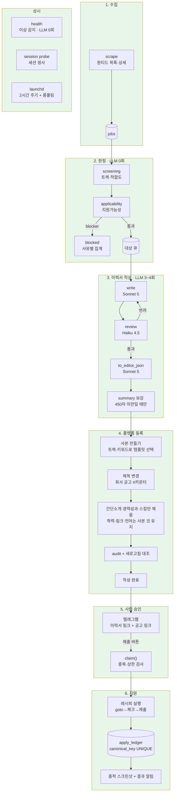

# autoapply — 전체 지도와 할 일

이 문서가 작업 기준이다. 무엇이 도는지, 무엇이 안 도는지, 다음에 뭘 할지가
여기 있다. 세부 함정과 그 이유는 [NEXT.md](NEXT.md)에 남긴다.

마지막 갱신: 2026-08-16

---

## 파이프라인

색: 초록 = 검증됨 · 노랑 = 동작하나 미검증 · 주황 = 실주행 안 해봄

**2026-08-16 — 체인이 처음으로 끝까지 닫혔다.** 수집 → 판정 → 이력서 작성 →
사본 등록 → 폰 승인 → 실제 제출까지 사람이 버튼 하나만 눌러 끝났다
(공고 1025 데이원컴퍼니, `apply_ledger.submitted`, 증적에 '지원이 완료되었습니다').

---

## 지원서 내용을 정하는 모델

공고에 맞춰 무엇을 쓸지는 **3~4회의 LLM 호출**이 나눠 맡는다. 한 모델이
통째로 하지 않는다 — 쓰는 눈과 보는 눈을 갈라야 자기가 지어낸 걸 잡는다.

| 단계 | 모델 | 하는 일 |
|---|---|---|
| `write()` | Sonnet 5 | 공고 본문 + 작성 가이드 + **사실 저장소**를 읽고 이력서를 쓴다. 저장소에 없는 수치·기술은 못 쓰고, 공고가 요구하는데 근거가 없으면 `## 대응 근거 없음`에 `[필수]`/`[우대]`로 신고한다 |
| `review()` | Haiku 4.5 | 치명적 문제만 본다 — 날조, 확정값 불일치, 필수요건 누락, 포맷 위반. 문체는 안 건드린다(취향으로 반려하면 루프가 안 끝난다) |
| `write(feedback)` | Sonnet 5 | 반려 사유만 고쳐 재작성. 최대 2라운드 |
| `to_editor_json()` | Sonnet 5 | MD를 편집기 스키마 JSON으로 옮긴다. 여기서 `[필수]` 신고가 `required_gaps`가 되고, 1건이라도 있으면 **지원을 멈춘다** |
| `_ensure_summary_length()` | Sonnet 5 | 간단 소개가 450자 미만일 때만. 전체 재생성이 아니라 그 필드만 다시 묻는다 |

결과는 72시간 캐시된다(같은 공고 재조립 시 LLM 0회).

비전(`vision.py`)은 별도 축이다. 화면을 읽어 "의도한 내용이 실제로 보이나"를
본다 — DOM 대조가 못 보는 층이고, 플랫폼을 몰라도 된다.

---

## 완료

### 수집 · 판정
- [x] 원티드 목록/상세 수집 (`scrape`, detail_limit 800)
- [x] 두 축 판정 — `screening`(적합도)과 `applicability`(지원가능성) 분리
- [x] blocker/requires 구분, 사유별 집계(`blocked`)
- [x] `form_essays: false` — 원티드는 폼에 자소서 칸이 없다
- [x] L1 이상 감지(`health`) — 과거 버그를 재현해 검증. LLM 0회

### 안전장치
- [x] `apply_ledger.canonical_key` UNIQUE — 스키마가 중복지원을 막는다
- [x] `claim()` 단일 관문 — 중복·일일/회차 상한을 한 곳에서
- [x] dry-run 기본. `--live`는 절대 암묵적으로 켜지지 않는다
- [x] 세션 생사 3분기 판정 — **모르는 것과 죽은 것을 구분**
- [x] `UsageLimited`를 고장과 구분 — 한도는 자리를 놓고 나중에 재개

### 이력서 작성
- [x] 작성 → 검수 → 재작성 LLM 체인, 72시간 캐시
- [x] 사실 저장소 밖의 날조 차단, `required_gaps` 있으면 중단
- [x] **사본 만들기 기반 등록** — 완성도 71% 정체를 원인째 제거
- [x] 트랙·키워드로 사본메이커 선택 (개발자용/데브옵스/AX/영업)
- [x] 제목 = `{회사} {공고} #{DB 카운터}` — 중복 원천 차단
- [x] 학력·링크·언어는 사본 것 유지, 재직기간도 유지
- [x] **성과 행 삭제** — 공고와 안 맞는 성과는 지운다
- [x] 스킬 자동완성 등록 (변형 이름 매칭)
- [x] `fill_report` 구조화 로그 — 실패를 조회한다(`cli.py builds`)
- [x] 화면 대조(`audit`) + 새로고침 후 저장 확인 + 비전 점검
- [x] 이력서 정리 — 웹에서 지우고 로컬 사본은 남긴다(`resumes --cleanup`)

### 운영
- [x] launchd 2계열 — 2시간 주기 실행 + 롱폴링 상주
- [x] 경과시간 기반 게이팅 — plist 스케줄과 분리
- [x] 텔레그램 승인 버튼, 응답 2.9초 (이전 2시간)
- [x] 개인정보 `.gitignore` (주석 위치 함정 포함)

---

## 남은 일

우선순위 순. 체인은 닫혔으므로 이제부터는 **넓히는 일과 지키는 일**이다.

### P0 — 체인을 닫는 것 ✅ 완료
- [x] 승인 3분기(승인/폐기/수정요청) + 수정요청 재작성 루프
- [x] 비개발 트랙 재해석 — 영업 공고에 개발 프레임으로 쓰이던 것 (§7-1)
- [x] **실제 제출 검증** — 텔레그램 승인 → 제출까지 정상 (공고 1025)
- [x] **사본 경로 이력서로 실제 지원** — `#{n}` 제목이 지원 폼에서 정상 선택됨

### P1 — 커버리지
- [x] biz 트랙 실주행 (공고 1025, 영업 사본메이커 경로 정상)
- [ ] presales 트랙 실주행
- [ ] 경력(회사) 자체가 여러 건일 때. 사실 저장소에 1건뿐이라 못 해봄
- [ ] 사람인·자소설 편집기 레시피. 어댑터는 확인됐고 레시피 JSON만 없다

### P2 — 알려진 결함
- [ ] 텔레그램 400 — 링크가 든 캡션이 전송 실패
- [ ] 스킬 정리(prune)를 켜면 스킬이 사라진다. 삭제는 되는데 이후 추가가 안 됨.
      기본 꺼둠 — 사본 스킬은 비어 있어 지금은 추가만 하면 된다
- [ ] 원티드 DB에 없는 스킬(`Qdrant` 등)은 등록 불가. 대체 표기 매핑 필요.
      비개발 트랙은 §7-1이 도구 고유명사만 쓰게 해서 해소됐다(5/5 등록)
- [ ] 링크 2건 이상 추가 안 됨 (사본이 들고 오므로 당장은 안 막힌다)

### P3 — 자가 개선
- [x] **비전을 자가개선에 연결** — 증적 스크린샷을 에이전트에게 넘기기 전에
      먼저 읽어 글로 바꿔 할 일 본문에 박는다. 경로만 주면 읽을지 말지가
      에이전트에게 달렸고, 실제로 안 읽고 셀렉터를 추측으로 고친 적이 있다
- [x] **편집기 고장을 자가개선 신호로** — `apply_ledger`에는 지원 폼 실패만
      남아서, 71% 정체가 몇 주 동안 오케스트레이터에게 안 보였다. 이제
      `fill_report`를 읽어 증상을 플랫폼 단위로 묶어 올린다
- [x] 편집기 화면을 증적으로 저장 (`editor-{job_id}-{시각}.png`)
- [ ] 자가개선이 실제로 고장을 고치는지 — **아직 진짜 고장으로 안 돌려봤다.**
      신호가 뜨는 것과 고쳐지는 것은 다르다
- [ ] 브랜치에 쌓인 수정을 사람이 검토하는 흐름 (지금은 브랜치만 남는다)
