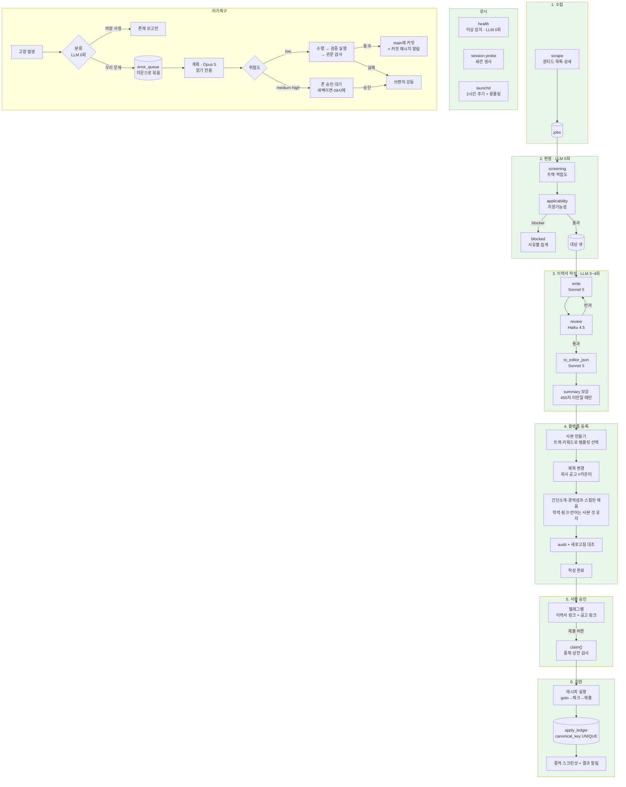

# autoapply — 전체 지도와 할 일

이 문서가 작업 기준이다. 무엇이 도는지, 무엇이 안 도는지, 다음에 뭘 할지가
여기 있다. 세부 함정과 그 이유는 [NEXT.md](NEXT.md)에 남긴다.

마지막 갱신: 2026-08-16

---

## 파이프라인

색: 초록 = 검증됨 · 노랑 = 동작하나 미검증 · 주황 = 실주행 안 해봄

**2026-08-16 — 체인이 처음으로 끝까지 닫혔다.** 수집 → 판정 → 이력서 작성 →
사본 등록 → 폰 승인 → 실제 제출까지 사람이 버튼 하나만 눌러 끝났다
(공고 1025 데이원컴퍼니, `apply_ledger.submitted`, 증적에 '지원이 완료되었습니다').

---

## 지원서 내용을 정하는 모델

공고에 맞춰 무엇을 쓸지는 **3~4회의 LLM 호출**이 나눠 맡는다. 한 모델이
통째로 하지 않는다 — 쓰는 눈과 보는 눈을 갈라야 자기가 지어낸 걸 잡는다.

| 단계 | 모델 | 하는 일 |
|---|---|---|
| `write()` | Sonnet 5 | 공고 본문 + 작성 가이드 + **사실 저장소**를 읽고 이력서를 쓴다. 저장소에 없는 수치·기술은 못 쓰고, 공고가 요구하는데 근거가 없으면 `## 대응 근거 없음`에 `[필수]`/`[우대]`로 신고한다 |
| `review()` | Haiku 4.5 | 치명적 문제만 본다 — 날조, 확정값 불일치, 필수요건 누락, 포맷 위반. 문체는 안 건드린다(취향으로 반려하면 루프가 안 끝난다) |
| `write(feedback)` | Sonnet 5 | 반려 사유만 고쳐 재작성. 최대 2라운드 |
| `to_editor_json()` | Sonnet 5 | MD를 편집기 스키마 JSON으로 옮긴다. 여기서 `[필수]` 신고가 `required_gaps`가 되고, 1건이라도 있으면 **지원을 멈춘다** |
| `_ensure_summary_length()` | Sonnet 5 | 간단 소개가 450자 미만일 때만. 전체 재생성이 아니라 그 필드만 다시 묻는다 |

결과는 72시간 캐시된다(같은 공고 재조립 시 LLM 0회).

비전(`vision.py`)은 별도 축이다. 화면을 읽어 "의도한 내용이 실제로 보이나"를
본다 — DOM 대조가 못 보는 층이고, 플랫폼을 몰라도 된다.

---

## 완료

### 수집 · 판정
- [x] 원티드 목록/상세 수집 (`scrape`, detail_limit 800)
- [x] 두 축 판정 — `screening`(적합도)과 `applicability`(지원가능성) 분리
- [x] blocker/requires 구분, 사유별 집계(`blocked`)
- [x] `form_essays: false` — 원티드는 폼에 자소서 칸이 없다
- [x] L1 이상 감지(`health`) — 과거 버그를 재현해 검증. LLM 0회

### 안전장치
- [x] **예전에 직접 낸 지원을 작업 전에 잡는다** (2026-08-16) — 원장은 우리가
      낸 것만 안다. 이력서 조립 전에 공고 페이지를 열어 '지원완료' 표시를 보고,
      있으면 원장에 `external`로 적어 대기열에서 영구히 뺀다. 목표 건수·일일
      한도·제출 통계 어디에도 안 셈. 자세한 내용은 [NEXT.md](NEXT.md) 맨 위
- [x] **끝난 자리는 다음 수집부터 상세를 안 받는다** (2026-08-16) — 목록은
      막을 수 없지만(API에 제외 인자가 없다) 공고당 요청 하나인 상세 조회를
      건너뛴다. `detail_limit` 자리를 진짜 후보에게 돌려주는 효과가 더 크다.
      canonical_key와 **(플랫폼, 공고 id)를 함께** 본다 — 제목이 바뀌면 키가
      갈려 되살아나기 때문이다. 같은 이유로 `v_actionable`에도 job_id 차단 추가
- [x] `apply_ledger.canonical_key` UNIQUE — 스키마가 중복지원을 막는다
- [x] `claim()` 단일 관문 — 중복·일일/회차 상한을 한 곳에서
- [x] dry-run 기본. `--live`는 절대 암묵적으로 켜지지 않는다
- [x] 세션 생사 3분기 판정 — **모르는 것과 죽은 것을 구분**
- [x] `UsageLimited`를 고장과 구분 — 한도는 자리를 놓고 나중에 재개

### 이력서 작성
- [x] 작성 → 검수 → 재작성 LLM 체인, 72시간 캐시
- [x] 사실 저장소 밖의 날조 차단, `required_gaps` 있으면 중단
- [x] **사본 만들기 기반 등록** — 완성도 71% 정체를 원인째 제거
- [x] 트랙·키워드로 사본메이커 선택 (개발자용/데브옵스/AX/영업)
- [x] 제목 = `{회사} {공고} #{DB 카운터}` — 중복 원천 차단
- [x] 학력·링크·언어는 사본 것 유지, 재직기간도 유지
- [x] **성과 행 삭제** — 공고와 안 맞는 성과는 지운다
- [x] 스킬 자동완성 등록 (변형 이름 매칭)
- [x] `fill_report` 구조화 로그 — 실패를 조회한다(`cli.py builds`)
- [x] 화면 대조(`audit`) + 새로고침 후 저장 확인 + 비전 점검
- [x] **수정 요청 원장**(`profile/revision-log.md`) — 지시를 한 줄로 남기고
      다음 이력서를 쓸 때 가이드와 함께 읽는다. 같은 공고의 지시는 누적되고,
      다른 공고 것은 근거가 성립할 때만 적용한다
- [x] 이력서 정리 — 웹에서 지우고 로컬 사본은 남긴다(`resumes --cleanup`)

### 자가복구 (2026-08-17)
- [x] **고장 큐** — 에러가 사라지지 않는다. `error_queue`에 지문으로 묶어 쌓고,
      바깥 사정(사이트·네트워크)과 우리 문제를 **LLM 없이** 가른다. 바깥 사정은
      폰에 보고만 하고 큐에 안 넣는다. 자세한 내용은 [NEXT.md](NEXT.md) 맨 위
- [x] **계획 ↔ 수행 세션 분리** — 계획(읽기 전용)이 `fix_plans`에 굳히고,
      승인이 오면 새 프로세스가 그것만 읽고 수행한다. 승인 버튼은 몇 시간 뒤에
      눌리므로 한 세션이 기다릴 수 없다
- [x] **위험도 낮으면 승인 없이 main에 반영** — 새벽에 깨져도 아침엔 고쳐진
      채로 돈다. 단 조건 셋이 다 필요하다: 계획이 low + 검증 명령 실제 통과 +
      결정론 관문 통과. 하나라도 걸리면 브랜치로 강등하고 사람에게 묻는다
- [x] **하네스** — PreToolUse 훅이 DB 파괴·실제 제출·git push·개인정보 유출을
      막는다. `--settings`로 에이전트에게만 건다(사람 세션은 안 묶인다)
- [x] **도는 동안 자동지원 보류** — 고장 난 채로 지원이 계속 나가지 않는다.
      사람이 건 `/pause`와 다른 열쇠를 써서, 자가복구가 끝나도 사람의 정지는
      안 풀린다
- [ ] 자가복구가 **실제 고장을 실제로 고치는지** — 신호가 뜨는 것과 고쳐지는
      것은 다르다. 첫 실주행 결과를 여기 적을 것

### 운영
- [x] **동시 실행 사고 3종 정리** (2026-08-16 실주행에서 드러남) —
      상주 브라우저를 쓰기 시작한 뒤 생긴 것들이다. 자세한 내용은
      [NEXT.md](NEXT.md) `## 완료` 참고
      - 남의 크롬에 붙던 것 → 포트 점유자의 `--user-data-dir`로 신원 확인,
        우리 탭(targetId)만 사용
      - 뒤에 온 작업이 탭을 뺏던 것 → flock 배타 잠금 + `BrowserBusy` 안내
      - 수집을 멈출 수 없던 것 → `running_tasks` + 텔레그램 `/running` `/stop`
- [x] launchd 2계열 — 2시간 주기 실행 + 롱폴링 상주
- [x] 경과시간 기반 게이팅 — plist 스케줄과 분리
- [x] 텔레그램 승인 버튼, 응답 2.9초 (이전 2시간)
- [x] 개인정보 `.gitignore` (주석 위치 함정 포함)
- [x] 상주 브라우저 렌더러 정지 자동 회복 — 오래 켜두면(실측 5시간+)
      스크린샷만 조용히 타임아웃되는 상태가 됐는데, 껐다 켜면 즉시 회복됨을
      실측으로 확인. `screenshot()` 실패 시 표시만 남기고 다음 세션 시작
      때 자동 재시작하게 만들어 사람 개입 없이 회복. 자세한 내용은
      [NEXT.md](NEXT.md) `## 완료` 참고
- [x] **LLM 호출마다 토큰·비용을 job_id로 기록** (2026-08-16 지시) —
      write·review·to_editor_json·portfolio_match·summary_ensure·
      revision_summary·guide_edit·vision 전부 `llm_calls` 테이블에 남는다.
      `cli.py llm-cost <job_id>`로 공고 하나에 LLM을 얼마나 썼는지, 인자
      없이 부르면 최근 20건 요약을 본다. 실제 호출로 기록·조회 확인.

---

## 남은 일

우선순위 순. 체인은 닫혔으므로 이제부터는 **넓히는 일과 지키는 일**이다.

### P0 — 체인을 닫는 것 ✅ 완료
- [x] 승인 3분기(승인/폐기/수정요청) + 수정요청 재작성 루프
- [x] 비개발 트랙 재해석 — 영업 공고에 개발 프레임으로 쓰이던 것 (§7-1)
- [x] **실제 제출 검증** — 텔레그램 승인 → 제출까지 정상 (공고 1025)
- [x] **사본 경로 이력서로 실제 지원** — `#{n}` 제목이 지원 폼에서 정상 선택됨

### P0-B — 새벽 자동화 재설계 (2026-08-16 지시, 구현·검증 완료)

지금은 하루 12번(2시간마다) 깨어나 폰 메시지 수신 + 자기개선을 매번 하고,
수집·판정·지원준비만 6시간 간격으로 골라서 한다. 아래로 바꾼다:

    새벽 2~6시  수집 → 판정 → 지원준비(dry-run)를 반복. 목표 30건 준비되거나
                더 준비할 신규 대상이 없으면 그 자리에서 멈춘다(시계 아님)
    아침 9시    그 사이 준비된 것들을 한 번에 폰으로 보낸다(사진+버튼)
    그 외 시간  아무것도 자동으로 안 돈다. 사람이 텔레그램으로 부를 때만:
                  · `/지원시작 <건수>` — 새벽 루프와 같은 걸 즉시, 그 자리에서 알림
                  · 자기개선은 문제가 자체진단됐을 때(새벽 루프 끝에서 확인)
                    또는 사람이 텔레그램으로 부를 때만 — 2시간마다 자동 호출 안 함

과거에 시각을 두 군데(plist, 스크립트)에 따로 적었다가 어긋나서 수집이 한 번도
안 돈 적이 있다(`schedule/run.sh` 주석 참고) — 이번엔 launchd가 모드 인자를
넘기게 해서 "몇 시냐"를 스크립트가 다시 추측하지 않게 한다.

- [x] `resumes.max_keep` 20 → 31 (config.yaml). 검증: `effective_config()`로
      값 반영 확인. 실제 계정 상태로 cleanup dry-run까지는 안 돌려봄(31개를
      넘겨본 적이 없어 지금 눈으로 확인 불가 — 자연히 쌓이면 확인)
- [x] 지원 완료 즉시 그 이력서를 플랫폼에서 지운다(`_apply_with`의
      `mark_submitted` 직후, `resume_editor.delete_after_submit`). 로컬
      사본 있을 때만 지운다. 실제 제출이 아직 안 나가서 왕복 확인은
      다음 실제 제출에서 — `delete_resume()`(cleanup에서 실사용 중) 그대로
      재사용이라 코드 경로 자체의 위험은 낮음
- [x] 지원 준비 알림 지연 발송 — `_report_prepared(defer=True)`가
      `pending_notifications`에 쌓고 `flush-notify`가 순서대로 보낸다.
      검증: 실제로 2건 큐잉 → flush → 텔레그램 도착 확인
- [x] 새벽 루프 본체 — `cli.py night-cycle --target N`. 검증: 실제로
      `--target 1 --defer`를 끝까지 돌림(원티드 실수집 1151건 → 판정 →
      조립 → dry-run 등록 1건, "목표 도달"로 정상 종료). 이 과정에서 버그
      하나 잡음 — apply 하위 error(RecipeError)를 성공으로 잘못 셈. 고침
- [x] 텔레그램 `/지원시작 <건수>` — night-cycle을 서브프로세스로, 즉시 알림
      모드. 실제 버튼 누름 왕복은 미확인(코드 경로는 /guide와 동일 패턴)
- [x] 자기개선 자동 호출 조건화 — `run.sh`에서 매 사이클 `improve` 제거.
      night-cycle 끝에서 `orchestrator.self_items()` 있을 때만 자동 호출,
      그 외엔 텔레그램 `/improve`. 도움말 문구도 고침. 검증: 실제 실행에서
      self_items 없어 improve 서브프로세스 안 뜬 것 확인(자동 트리거 조용함)
- [x] launchd 재구성 — `com.autoapply.cycle` 폐기(bootout+plist 삭제),
      `com.autoapply.night`(02:00)·`com.autoapply.flush`(09:00) 신설,
      `com.autoapply.listen`은 유지. 검증: `launchctl list`로 cycle 사라짐·
      night/flush 등록 확인, `kickstart -p`로 flush 실제 실행해 run.sh가
      인자를 받아 옳은 분기를 타는지 확인(sent:0으로 정상 종료)
- [x] **수집을 지원준비에서 분리, 낮 12시 별도 스케줄로** (2026-08-16 지시).
      `night-cycle`이 수집(수 분)까지 매번 같이 하고 있어서, 텔레그램 `/apply`로
      지원준비만 급히 부를 때도 전체 수집이 딸려 왔다. `cli.py scrape
      --check-session`을 `com.autoapply.scrape`(12:00)로 분리하고,
      `night-cycle`은 이미 모아둔 대기열에서만 고르게 정리. 검증: `_night_cycle`
      리팩터 후 `target=0`으로 실행해 스크래핑 없이(서브프로세스 호출도 없이)
      정상 반환하는 것 확인, `schedule/install.sh`로 4개 잡(scrape·night·flush·
      listen) 전부 재등록해 `launchctl list`로 확인(listen이 bootout/bootstrap
      경합으로 한 번 실패했다가 재시도로 정상화 — install.sh는 순차 실행이라
      드물게 이 경합이 날 수 있다는 걸 남겨둔다).
- [ ] 끝나면 텔레그램으로 완료 보고

### P1 — 커버리지
- [x] **포트폴리오 매칭** — 공고에 맞는 포트폴리오를 에이전트가 골라 지원 폼에서
      이력서와 같이 체크(`portfolio.py`). 실측으로 포트폴리오가 이력서와 같은
      체크리스트를 쓴다는 것과, 포트폴리오 파일명만 유니코드 NFD로 렌더링된다는
      함정을 확인. LLM 매칭 3/3 정답(DevOps·AI·영업 모두), `build_editor_json()`
      실호출로 매칭→DB 저장 경로까지 확인. 자세한 내용은 [NEXT.md](NEXT.md)
      `## 완료` 참고
- [x] biz 트랙 실주행 (공고 1025, 영업 사본메이커 경로 정상)
- [ ] presales 트랙 실주행
- [ ] 경력(회사) 자체가 여러 건일 때. 사실 저장소에 1건뿐이라 못 해봄
- [ ] 사람인·자소설 편집기 레시피. 어댑터는 확인됐고 레시피 JSON만 없다

### P1-B — 이력서 관리 (2026-08-16 정리)

계정에 남기는 것은 **9개뿐이다.** 그 밖의 것은 파이프라인이 만들었다 지운다.

    박예일 기본                기준 이력서. 지우지도, 채우지도 않는다
    박예일 개발자용 사본메이커   dev / mes_erp
    박예일 데브옵스 사본메이커   키워드(devops·sre·인프라·k8s…)
    박예일 AX개발자 사본메이커   키워드(llm·rag·ai엔지니어…) / pm
    박예일 영업 사본메이커       biz / presales
    포트폴리오 PDF 4종          업로드 문서. 이력서 목록에 같이 보인다

이 5개 이력서는 `config.yaml`의 `resumes.protect`에 있고, 그 목록은
**삭제 금지이자 편집 금지**다(`resume_editor.protected_titles()`).
`fill()`이 그 제목을 열면 `ProtectedResume`로 멈춘다 — 편집기는 자동저장이라
한 필드만 지나가도 되돌릴 수 없고, 사본메이커가 오염되면 거기서 뜬 사본이
전부 같이 오염된다.

- [x] 개발 중 만든 시험 이력서 정리 — 플랫폼에는 이미 없고(사람이 지움),
      `made_resumes`에만 남아 있던 8건을 `resumes --cleanup`이 정리하도록
      만들고 실행(#6~#13). 이제 사라진 이력서 기록은 스스로 정리된다
- [ ] **'박예일 기본'의 내용 확인** — 재사용 경로가 이 이력서를 여러 공고로
      덮어썼다(스킬은 추가만 하므로 공고별 스킬이 쌓여 있을 수 있다).
      기준 이력서로 다시 쓰려면 사람이 한 번 봐야 한다.
      검증: 스킬 목록과 간단 소개가 특정 공고 냄새 없이 기준값인지 눈으로 확인

### P1-C — 예전 지원 일괄 확인 (선택)

지금은 **그 공고를 준비하려 할 때** 한 건씩 확인한다(건당 ~11초). 대기열
122건에 예전 지원이 여럿 섞여 있으면 그만큼 준비가 늦어질 뿐, 낭비되는 건
없다(조립 전에 멈춘다).

- [ ] 원티드 '지원 현황' 목록을 한 번 읽어 예전 지원을 통째로 `external`에
      적는 경로. 페이지 하나로 전부 처리되면 건당 확인이 필요 없어진다.
      검증: 목록에서 읽은 건수만큼 원장에 external이 생기고, 그 자리들이
      `v_actionable`에서 사라짐. 사람이 지원한 적 없는 공고는 안 들어감

### P2 — 알려진 결함
- [ ] 원장 요약이 한 단어 지시('짧게')에서 근거를 지어낼 때가 있다. 기록한 줄을
      폰으로 되돌려주므로 사람이 파일에서 고칠 수 있지만, 스스로는 못 걸러낸다
- [x] 같은 취지의 지시가 반복되면 `resume-guide.md`로 올려야 한다. **자동 감지는
      폐기** — 한 공고의 특수한 요구가 조용히 규칙이 될 위험이 이득보다 크다.
      대신 텔레그램 `/revlog`로 원장을 보고 사람이 판단해 `/guide`로 직접
      옮긴다(2026-08-16)
- [ ] 텔레그램 400 — 링크가 든 캡션이 전송 실패
- [ ] 스킬 정리(prune)를 켜면 스킬이 사라진다. 삭제는 되는데 이후 추가가 안 됨.
      기본 꺼둠 — 사본 스킬은 비어 있어 지금은 추가만 하면 된다
- [ ] 원티드 DB에 없는 스킬(`Qdrant` 등)은 등록 불가. 대체 표기 매핑 필요.
      비개발 트랙은 §7-1이 도구 고유명사만 쓰게 해서 해소됐다(5/5 등록)
- [ ] 링크 2건 이상 추가 안 됨 (사본이 들고 오므로 당장은 안 막힌다)

### P3 — 자가 개선
- [x] **고장 큐 · 계획/수행 분리 · 자동반영** (2026-08-17) — 위 `자가복구` 참고
- [x] **비전을 자가개선에 연결** — 증적 스크린샷을 에이전트에게 넘기기 전에
      먼저 읽어 글로 바꿔 할 일 본문에 박는다. 경로만 주면 읽을지 말지가
      에이전트에게 달렸고, 실제로 안 읽고 셀렉터를 추측으로 고친 적이 있다
- [x] **편집기 고장을 자가개선 신호로** — `apply_ledger`에는 지원 폼 실패만
      남아서, 71% 정체가 몇 주 동안 오케스트레이터에게 안 보였다. 이제
      `fill_report`를 읽어 증상을 플랫폼 단위로 묶어 올린다
- [x] 편집기 화면을 증적으로 저장 (`editor-{job_id}-{시각}.png`)
- [ ] 자가개선이 실제로 고장을 고치는지 — **아직 진짜 고장으로 안 돌려봤다.**
      신호가 뜨는 것과 고쳐지는 것은 다르다
- [ ] 브랜치에 쌓인 수정을 사람이 검토하는 흐름 (지금은 브랜치만 남는다)
